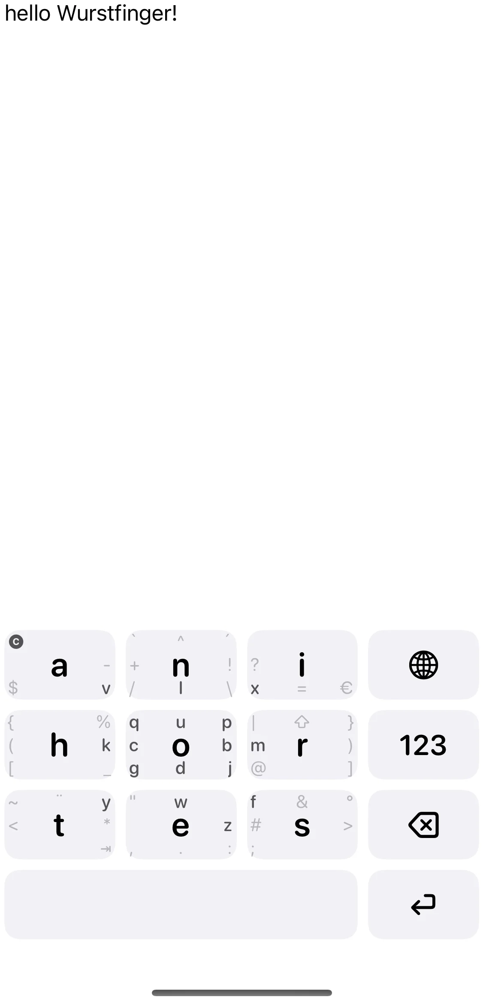

# Wurstfinger

*The keyboard for fat fingers.*

I started this project because my favorite keyboard, MessagEase, stopped
working on iOS 26. The project now supports 14 languages and aims to be a full
replacement for MessagEase—pull requests are very welcome!

The name “Wurstfinger” is a nod to the “fat finger” problem—thumb-heavy typing on small screens.

Wurstfinger is a MessagEase-inspired keyboard for iOS written in SwiftUI. It
brings thumb-friendly gestures from Thumb-Key and the original MessagEase
layout to Apple devices, including circular gestures for uppercase letters,
return swipes for typographic punctuation, and compose rules to generate
accented characters.

## Preview

<p align="center">
  <picture>
    <source media="(prefers-color-scheme: dark)" srcset="docs/images/demo-text-dark.webp">
    <source media="(prefers-color-scheme: light)" srcset="docs/images/demo-text-light.webp">
    
  </picture>
</p>

<details>
<summary><b>More Screenshots</b></summary>

### Light Theme
<p align="center">
  
  
</p>

### Dark Theme
<p align="center">
  
  
</p>
</details>

## Features

- **Multi-language support**: 14 languages including English, German, Spanish, French, Portuguese, Italian, Dutch, Swedish, Norwegian, Danish, Finnish, Polish, Czech, and Vietnamese
- **MessagEase layout** with symbol and numeric layers
- **Compose engine** that reproduces Thumb-Key's combination triggers (e.g. `' + a → á`)
- **Return swipes** for punctuation and math symbols (`?`→`¿`, `*`→`†`, `/`→`÷`, ...)
- **Circular gestures** on keys to insert uppercase letters
- **Drag gestures** for cursor movement and progressive deletion
- **Customizable settings**: Adjust haptic feedback intensity, keyboard scale, and key aspect ratio
- **Onboarding flow** with interactive setup guide
- Support for iOS 17+ (Swift 5, SwiftUI)

## Getting Started

### Prerequisites

- Xcode 16 (or newer)
- iOS 17 SDK

### Building

Open the project in Xcode:

```bash
xed wurstfinger/wurstfinger.xcodeproj
```

or build from the command line on macOS:

```bash
cd wurstfinger/wurstfinger
xcodebuild -scheme Wurstfinger -destination 'platform=iOS Simulator,name=iPhone 16' build
```

### Running Tests

The project includes unit tests for gesture handling and compose logic. Run
all tests with:

```bash
cd wurstfinger/wurstfinger
xcodebuild test -scheme Wurstfinger -destination 'platform=iOS Simulator,name=iPhone 16' -only-testing:WurstfingerTests
```

> **Note:** Some tests require an available iOS Simulator. Adjust the
> destination to match your local simulator name if necessary.

### Installing the Keyboard

1. Build and run the `Wurstfinger` scheme on a device or simulator.
2. The app includes an interactive onboarding guide that walks you through:
   - Adding the keyboard in **Settings › General › Keyboard › Keyboards**
   - Enabling "Allow Full Access" for cursor control and deletion features
   - Testing the keyboard in the practice view

### Project Layout

```
wurstfinger/
├─ README.md
├─ LICENSE
├─ wurstfinger/                # Xcode project root
│  ├─ wurstfinger.xcodeproj    # Project file
│  ├─ wurstfinger/             # Host app (minimal)
│  ├─ wurstfingerKeyboard/     # Keyboard extension sources
│  ├─ wurstfingerTests/        # Swift Testing unit tests
│  └─ wurstfingerUITests/      # UI test target (currently empty)
```

## License

This project is licensed under the [MIT License](LICENSE).

## Acknowledgements

- [MessagEase](https://www.exideas.com/) for the original layout concepts
- [Thumb-Key](https://github.com/dessalines/thumb-key) for inspiration and
  compose rules
