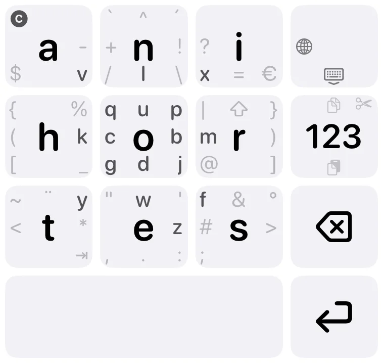
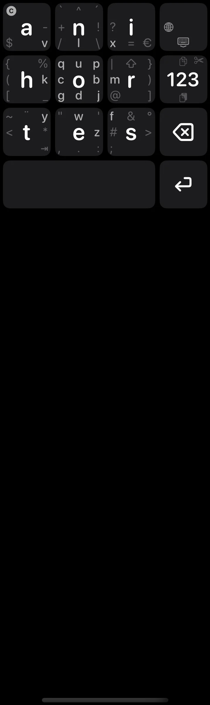
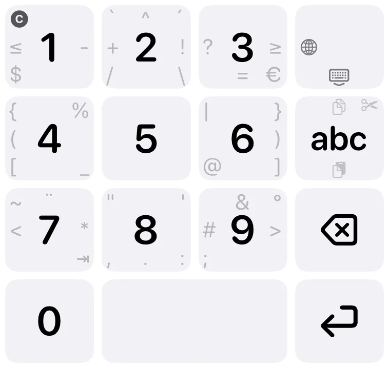
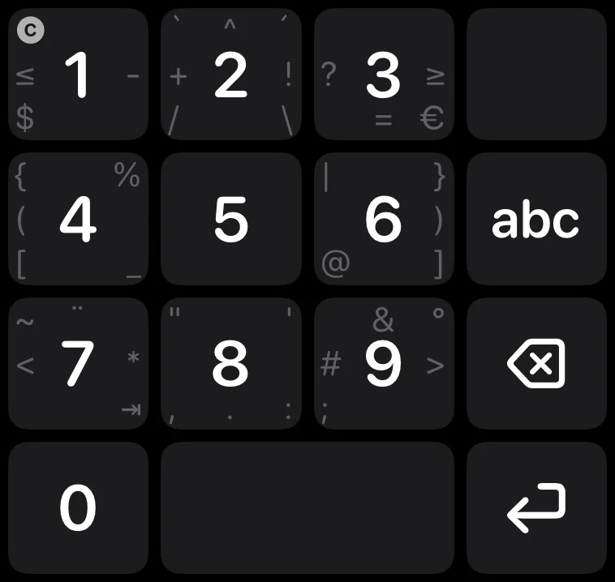

# Wurstfinger

[](https://apps.apple.com/de/app/wurstfinger/id6754844184)
[](https://testflight.apple.com/join/trX4rBPf)
[](LICENSE)

*The keyboard for fat fingers.*

The name “Wurstfinger” is a nod to the “fat finger” problem—thumb-heavy typing on small screens.

Wurstfinger is a MessagEase-inspired keyboard for iOS written in SwiftUI. It
brings thumb-friendly gestures from Thumb-Key and the original MessagEase
layout to Apple devices, including circular gestures for uppercase letters,
return swipes for typographic punctuation, and compose rules to generate
accented characters.

## Download

[](https://apps.apple.com/de/app/wurstfinger/id6754844184)

**Requirements:** iOS 17.0 or later

<table>
  <tr>
    <td width="50%">
      
      <p align="center"><i>Light Theme</i></p>
    </td>
    <td width="50%">
      
      <p align="center"><i>Dark Theme</i></p>
    </td>
  </tr>
  <tr>
    <td width="50%">
      
      <p align="center"><i>Numbers Layer</i></p>
    </td>
    <td width="50%">
      
      <p align="center"><i>Numbers Layer (Dark)</i></p>
    </td>
  </tr>
</table>

## Why Wurstfinger?

Traditional QWERTY keyboards waste screen space and require precise tapping. Wurstfinger uses a 3×3 grid with swipe gestures, so your thumbs travel less and hit the right key more often—even on small screens. Once you get past the learning curve (a few days of practice), you'll type faster and with fewer errors.

## Beta Testing

Want to try the latest features before they hit the App Store? Join our public TestFlight beta!

[](https://testflight.apple.com/join/trX4rBPf)

- Nightly builds with the latest features from the `develop` branch
- Help shape the keyboard with your feedback
- Early access to experimental features

## Features

- **Multi-language support**: 15 languages including Catalan, Croatian, English, Estonian-Finnish, Finnish, French, German, Hebrew, Italian, Polish, Russian, Spanish, Swedish, Tagalog, and Vietnamese (with Telex input)
- **MessagEase layout** with symbol and numeric layers
- **Compose engine** that reproduces Thumb-Key's combination triggers (e.g. `' + a → á`)
- **Return swipes** for punctuation and math symbols (`?`→`¿`, `*`→`†`, `/`→`÷`, ...)
- **Circular gestures** on keys to insert uppercase letters
- **Drag gestures** for cursor movement and progressive deletion
- **Customizable settings**: Adjust haptic feedback intensity, keyboard scale, and key aspect ratio
- **Onboarding flow** with interactive setup guide

## FAQ

Wondering why something doesn't work as expected? Check out the [Frequently Asked Questions](docs/FAQ.md) for common issues and their solutions.

## Getting Started

### Prerequisites

- Xcode 16 (or newer)
- iOS 17 SDK

### Building

Open the project in Xcode:

```bash
xed wurstfinger/wurstfinger.xcodeproj
```

or build from the command line on macOS:

```bash
cd wurstfinger/wurstfinger
xcodebuild -scheme Wurstfinger -destination 'platform=iOS Simulator,name=iPhone 16' build
```

### Running Tests

The project includes unit tests for gesture handling and compose logic. Run
all tests with:

```bash
cd wurstfinger/wurstfinger
xcodebuild test -scheme Wurstfinger -destination 'platform=iOS Simulator,name=iPhone 16' -only-testing:WurstfingerTests
```

> **Note:** Some tests require an available iOS Simulator. Adjust the
> destination to match your local simulator name if necessary.

### Installing the Keyboard

1. Build and run the `Wurstfinger` scheme on a device or simulator.
2. The app includes an interactive onboarding guide that walks you through:
   - Adding the keyboard in **Settings › General › Keyboard › Keyboards**
   - Enabling "Allow Full Access" for cursor control and deletion features
   - Testing the keyboard in the practice view

### Project Layout

```
wurstfinger/
├─ README.md
├─ LICENSE
├─ wurstfinger/                # Xcode project root
│  ├─ wurstfinger.xcodeproj    # Project file
│  ├─ wurstfinger/             # Host app (minimal)
│  ├─ wurstfingerKeyboard/     # Keyboard extension sources
│  ├─ wurstfingerTests/        # Swift Testing unit tests
│  └─ wurstfingerUITests/      # UI test target (currently empty)
```

## License

This project is licensed under the [MIT License](LICENSE).

## Acknowledgements

- [MessagEase](https://www.exideas.com/ME/) for the original layout concepts
- [Thumb-Key](https://github.com/dessalines/thumb-key) for inspiration and
  compose rules
